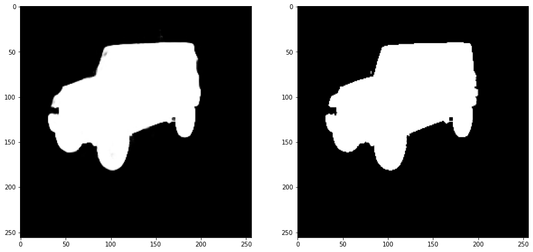
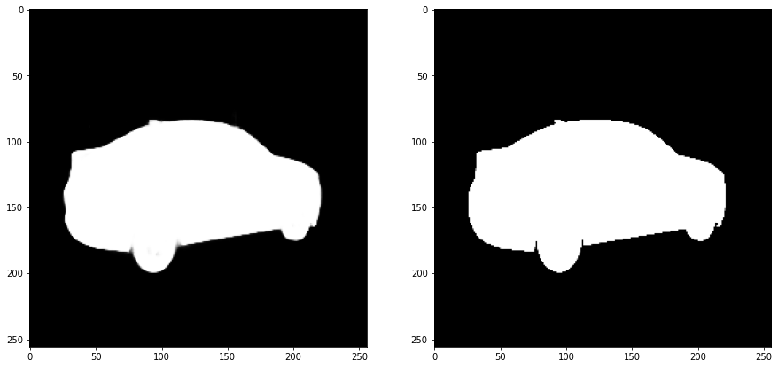
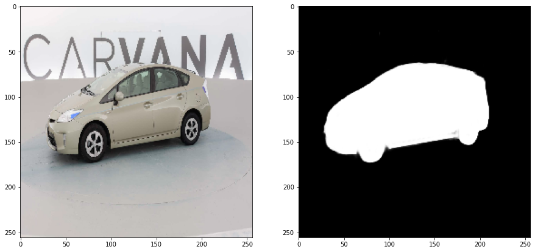
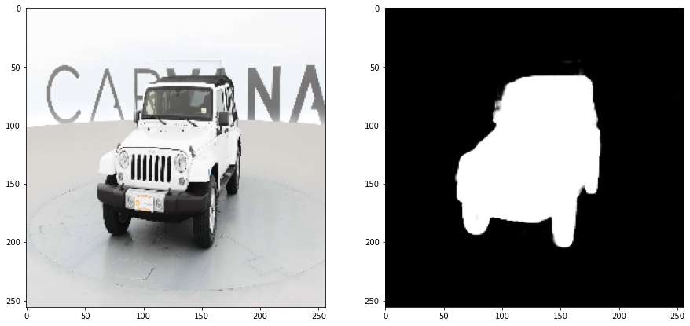
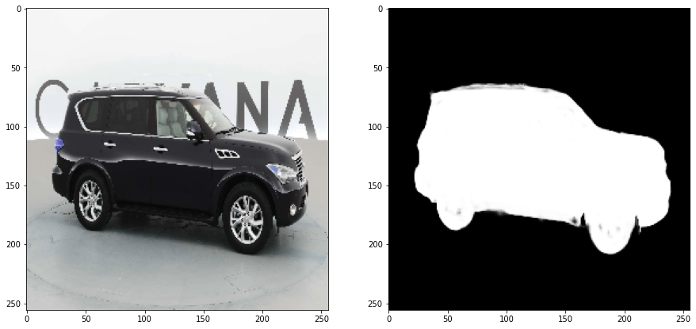
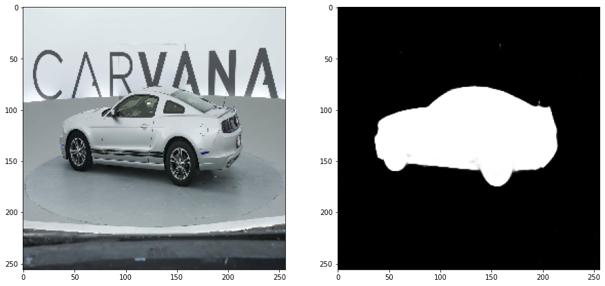

# Semantic Segmentation (Single Class)

We create the semantic segmentation of the dataset provided here https://www.kaggle.com/c/carvana-image-masking-challenge
  

We use the legendary U-Net for the purpose.
The model is save in UNet.py and the main code is in main.py

##Results:
#### Validation Set:
        Predicted Mask <--------------------> Original Mask

#### Test set:
        Predicted Mask <--------------------> Original Image

